# Adrian Garcia-Ontiveros

Backend-focused developer and rising senior at DePaul University, with full-stack experience across React/Next.js, Java/Spring Boot, and PostgreSQL. Exploring DevOps and cloud infrastructure as a long-term specialization.

## Tech Stack

## Currently Learning

## GitHub Stats

---

Open to full-time software engineering roles — Summer/Fall 2026. Feel free to reach out.
